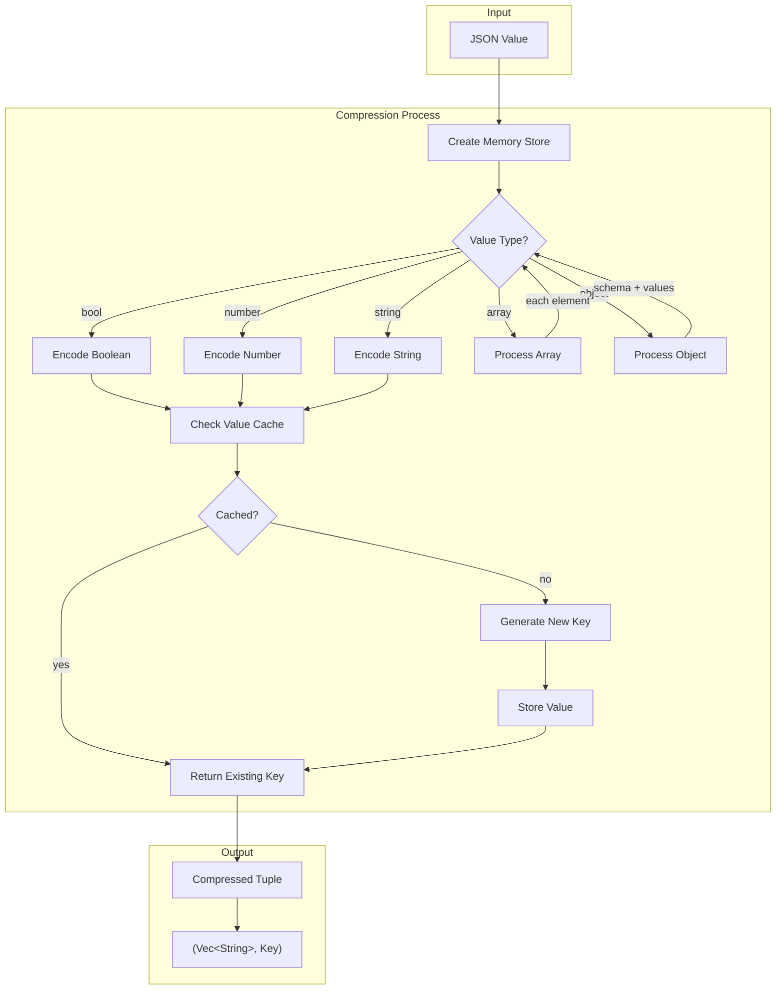
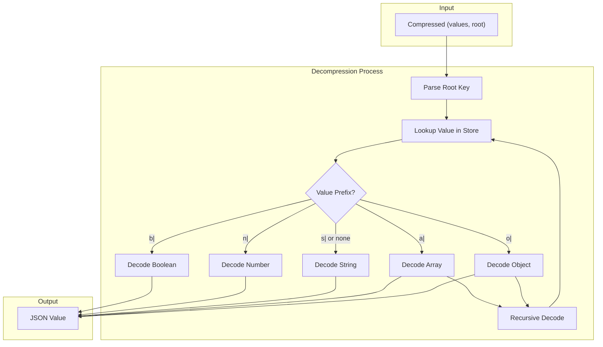
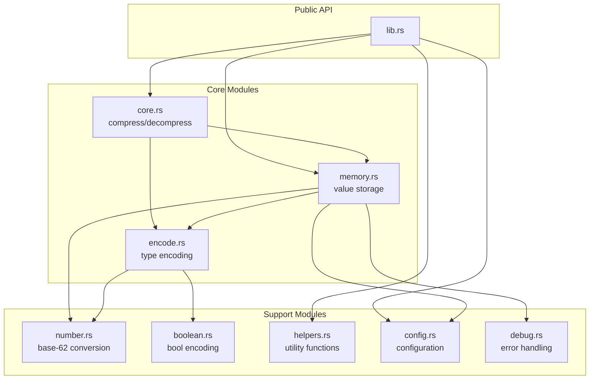
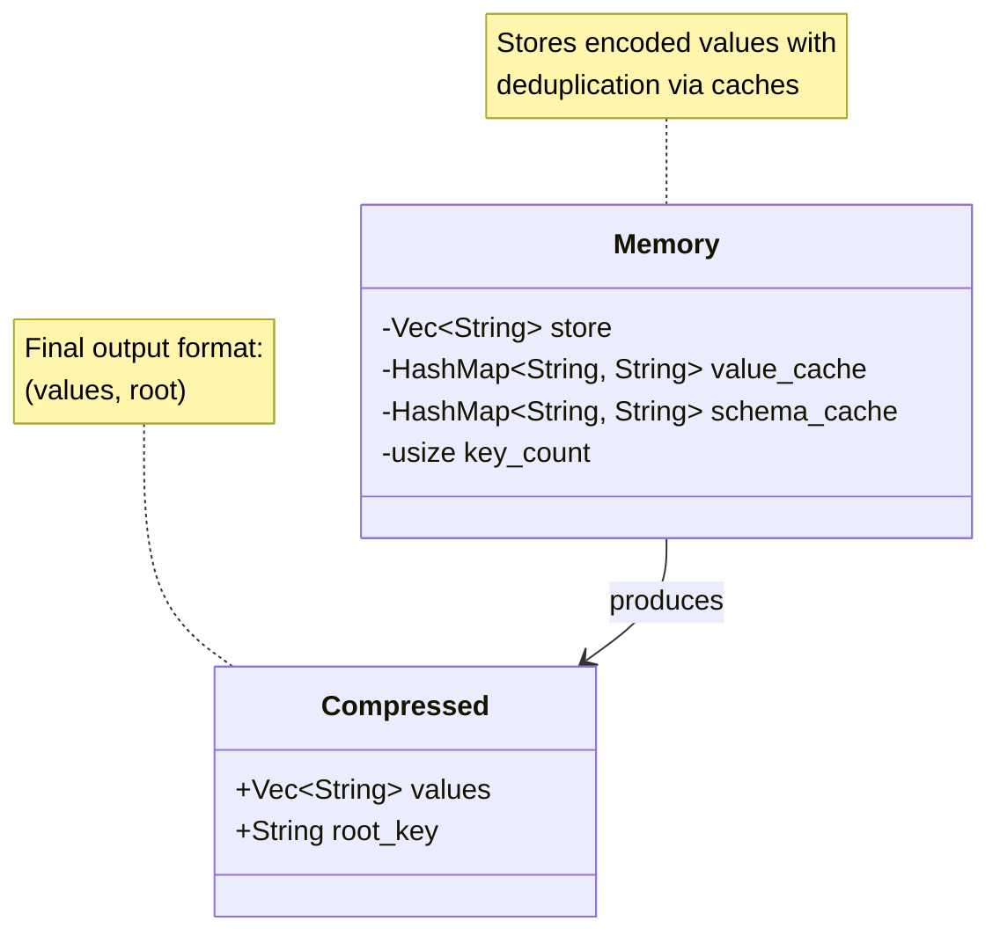
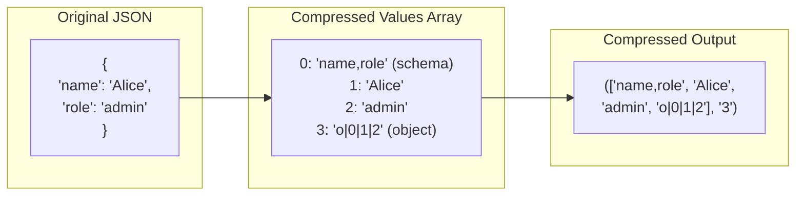
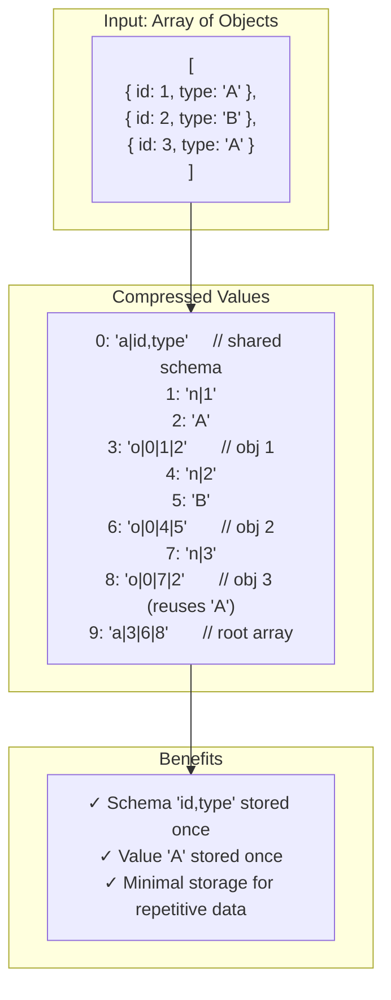
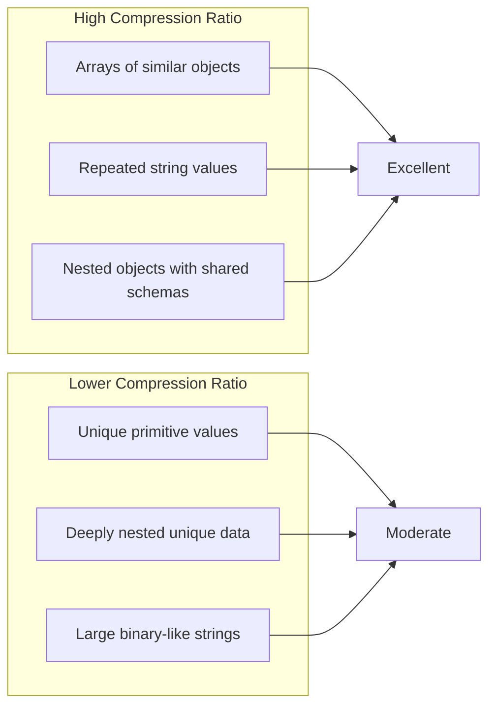

# compress-json-rs

[](https://crates.io/crates/compress-json-rs)
[](https://docs.rs/compress-json-rs)
[](LICENSE)

AI-driven Rust port of the JavaScript [compress-json](https://github.com/beenotung/compress-json) library by Beenotung.
Store JSON data in a space-efficient compressed form with lossless round-trip compression and decompression.

## Table of Contents

- [Features](#features)
- [Installation](#installation)
- [Quick Start](#quick-start)
- [Usage Examples](#usage-examples)
- [API Reference](#api-reference)
- [How It Works](#how-it-works)
- [Architecture](#architecture)
- [Compression Format](#compression-format)
- [Configuration](#configuration)
- [Helper Functions](#helper-functions)
- [Performance Considerations](#performance-considerations)
- [License](#license)

## Features

- **Full JSON Support**: Objects, arrays, strings, numbers, booleans, and null
- **Value Deduplication**: Repeated values stored once with reference keys
- **Schema Deduplication**: Objects with identical keys share schemas
- **Compact Encoding**: Numbers encoded in base-62 format
- **Type Safety**: Zero-copy round-trip using `serde_json::Value`
- **UTF-8 Safe**: Full Unicode support for strings
- **No Dependencies on Disk/Network**: Fast in-memory compression

## Installation

Add to your `Cargo.toml`:

```toml
[dependencies]
compress-json-rs = "0.1.0"
serde_json = "1.0"
```

## Quick Start

```rust
use compress_json_rs::{compress, decompress};
use serde_json::json;

fn main() {
    // Original JSON data
    let data = json!({
        "user": "Alice",
        "active": true,
        "roles": ["admin", "user"]
    });

    // Compress
    let compressed = compress(&data);
    
    // Decompress
    let restored = decompress(compressed);
    
    assert_eq!(data, restored);
}
```

## Usage Examples

### Basic Object Compression

```rust
use compress_json_rs::{compress, decompress};
use serde_json::json;

let user = json!({
    "id": 12345,
    "name": "Alice",
    "email": "alice@example.com",
    "settings": {
        "theme": "dark",
        "notifications": true
    }
});

let (values, root) = compress(&user);

// The compressed form is a tuple of:
// - values: Vec<String> - deduplicated value store
// - root: String - key pointing to the root value

println!("Values: {:?}", values);
println!("Root key: {}", root);

// Restore original
let restored = decompress((values, root));
assert_eq!(user, restored);
```

### Array with Repeated Objects

```rust
use compress_json_rs::{compress, decompress};
use serde_json::json;

// Arrays of objects with similar schemas benefit most from compression
let data = json!([
    { "type": "fruit", "name": "apple", "color": "red" },
    { "type": "fruit", "name": "banana", "color": "yellow" },
    { "type": "fruit", "name": "cherry", "color": "red" },
]);

let compressed = compress(&data);
let restored = decompress(compressed);

assert_eq!(data, restored);
```

### Serialization for Storage/Transmission

```rust
use compress_json_rs::{compress, decompress, Compressed};
use serde_json::json;

let data = json!({
    "items": [
        { "id": 1, "status": "active" },
        { "id": 2, "status": "active" },
        { "id": 3, "status": "pending" }
    ]
});

// Compress
let compressed = compress(&data);

// Serialize to JSON string for storage
let json_str = serde_json::to_string(&compressed).unwrap();
println!("Compressed JSON: {}", json_str);

// Later: deserialize and decompress
let loaded: Compressed = serde_json::from_str(&json_str).unwrap();
let restored = decompress(loaded);

assert_eq!(data, restored);
```

### Working with Files

```rust
use compress_json_rs::{compress, decompress, Compressed};
use serde_json::json;
use std::fs;

fn save_compressed(data: &serde_json::Value, path: &str) -> std::io::Result<()> {
    let compressed = compress(data);
    let json = serde_json::to_string(&compressed)?;
    fs::write(path, json)
}

fn load_compressed(path: &str) -> std::io::Result<serde_json::Value> {
    let json = fs::read_to_string(path)?;
    let compressed: Compressed = serde_json::from_str(&json)?;
    Ok(decompress(compressed))
}

// Usage
let data = json!({"key": "value"});
save_compressed(&data, "data.compressed.json").unwrap();
let restored = load_compressed("data.compressed.json").unwrap();
```

### Using Helper Functions

```rust
use compress_json_rs::{trim_undefined, trim_undefined_recursively};
use serde_json::{json, Map, Value};

// Remove null values from objects before compression
let mut data: Map<String, Value> = serde_json::from_value(json!({
    "name": "Alice",
    "middleName": null,  // Will be removed
    "age": 30
})).unwrap();

trim_undefined(&mut data);
// data now only contains "name" and "age"

// Recursively remove nulls from nested objects
let mut nested: Map<String, Value> = serde_json::from_value(json!({
    "user": {
        "name": "Bob",
        "extra": null  // Will be removed
    },
    "meta": null  // Will be removed
})).unwrap();

trim_undefined_recursively(&mut nested);
```

## API Reference

### Core Functions

```rust
/// Compressed representation: (values array, root key)
pub type Compressed = (Vec<String>, String);

/// Key type for value references
pub type Key = String;

/// Compress a JSON value into its compressed form
pub fn compress(o: &serde_json::Value) -> Compressed;

/// Decompress a compressed form back into JSON
pub fn decompress(c: Compressed) -> serde_json::Value;

/// Decode a single key from the values array
pub fn decode(values: &Vec<String>, key: &str) -> serde_json::Value;
```

### Lower-Level API

```rust
/// Memory structure for compression state
pub struct Memory { /* internal */ }

/// Create a new memory instance for compression
pub fn make_memory() -> Memory;

/// Add a value to memory, returns its reference key
pub fn add_value(mem: &mut Memory, o: &serde_json::Value) -> Key;

/// Convert memory to the values array
pub fn mem_to_values(mem: &Memory) -> Vec<String>;
```

### Helper Functions

```rust
/// Remove keys with null values from an object (shallow)
pub fn trim_undefined(object: &mut Map<String, Value>);

/// Recursively remove keys with null values from nested objects
pub fn trim_undefined_recursively(object: &mut Map<String, Value>);
```

### Configuration

```rust
/// Global configuration for compression behavior
pub struct Config {
    /// Whether to sort object keys (default: false)
    pub sort_key: bool,
    /// Whether to error on NaN values (default: false)
    pub error_on_nan: bool,
    /// Whether to error on infinite values (default: false)
    pub error_on_infinite: bool,
}

pub const CONFIG: Config;
```

## How It Works

The compression algorithm works by **deduplicating values** and **encoding references** using base-62 keys.

### Compression Flow



### Decompression Flow



## Architecture

### Module Structure



### Memory Structure



## Compression Format

### Value Encoding Prefixes

| Prefix | Type | Example Encoded | Original Value |
|--------|------|-----------------|----------------|
| `b\|T` | Boolean true | `b\|T` | `true` |
| `b\|F` | Boolean false | `b\|F` | `false` |
| `n\|` | Number | `n\|42.5` | `42.5` |
| `s\|` | Escaped string | `s\|n\|123` | `"n\|123"` |
| `a\|` | Array | `a\|0\|1\|2` | Array with refs 0,1,2 |
| `o\|` | Object | `o\|0\|1\|2` | Object with schema ref |
| (none) | Plain string | `hello` | `"hello"` |
| `""` or `_` | Null | `` | `null` |

### Key Encoding (Base-62)

Keys are encoded using base-62 for compact representation:

```
Characters: 0-9 A-Z a-z (62 total)

Examples:
  0 -> "0"
  9 -> "9"
  10 -> "A"
  35 -> "Z"
  36 -> "a"
  61 -> "z"
  62 -> "10"
  124 -> "20"
```

### Example Compression



### Schema Sharing Example



## Configuration

The library uses a compile-time configuration:

```rust
pub const CONFIG: Config = Config {
    sort_key: false,        // Don't sort object keys
    error_on_nan: false,    // Convert NaN to null
    error_on_infinite: false, // Convert Infinity to null
};
```

### Behavior Notes

- **NaN and Infinity**: By default, these invalid JSON numbers are silently converted to `null`
- **Key Order**: Object keys maintain insertion order unless `sort_key` is enabled
- **Unicode**: Full UTF-8 support for all string values

## Helper Functions

### trim_undefined

Removes keys with null values from an object (shallow operation):

```rust
use compress_json_rs::trim_undefined;
use serde_json::{json, Map, Value};

let mut obj: Map<String, Value> = serde_json::from_value(json!({
    "a": 1,
    "b": null,
    "c": 3
})).unwrap();

trim_undefined(&mut obj);
// obj = { "a": 1, "c": 3 }
```

### trim_undefined_recursively

Removes null values from nested objects:

```rust
use compress_json_rs::trim_undefined_recursively;
use serde_json::{json, Map, Value};

let mut obj: Map<String, Value> = serde_json::from_value(json!({
    "user": {
        "name": "Alice",
        "middleName": null
    },
    "extra": null
})).unwrap();

trim_undefined_recursively(&mut obj);
// obj = { "user": { "name": "Alice" } }
```

## Performance Considerations

### Best Use Cases



### Memory Usage

- Compression builds an in-memory store with hash maps for deduplication
- For very large JSON documents, consider streaming or chunked processing
- The compressed format itself is typically 30-70% smaller for repetitive data

### Compression Ratio Examples

| Data Type | Typical Ratio |
|-----------|---------------|
| API response arrays | 40-60% of original |
| Configuration files | 50-70% of original |
| Unique data | 90-100% of original |
| Highly repetitive | 20-40% of original |

## Testing

Run the test suite:

```bash
cargo test
```

The library includes comprehensive tests covering:
- Number encoding edge cases
- Unicode string handling  
- Empty objects and arrays
- Null value handling
- Deeply nested structures
- Schema deduplication

## License

Licensed under the BSD-2-Clause license. See [LICENSE](LICENSE) for details.

---

## Related Projects

- [compress-json](https://github.com/beenotung/compress-json) - Original TypeScript implementation
- [serde_json](https://github.com/serde-rs/json) - JSON serialization framework for Rust
